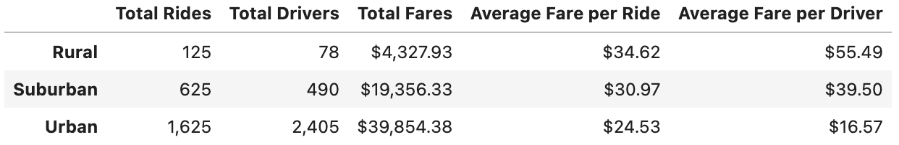

# PyBer Ride Sharing Data Analysis

## Overview of the analysis

This analysis is being performed in order to see what impact the type of city being serviced by PyBer has on several notable variables found in the data set, chiefly the total dollars in fares seen across the time frame given by the data but also total number of drivers and average fare found in each of these types of cities. This analysis will attempt to demonstrate if a meaningful correlation exists between the type of city being serviced by PyBer and the money coming in, both in total and in average per ride.

## Results

The restructured data, when sorted by city type, presented a data set that displayed the total number of drivers and fares in all cities of each type, and the averages per driver and per ride in all cities of each type. 

The most notable elements of this data are the large discrepancies in average fare and total fares.  We see that the rural cities accrued much less in total fares but had a much higher average ride cost, both by driver and by ride, while the urban cities were basically the exact opposite, with lower average ride cost but many more total rides and drivers leading to a much higher total in fares. Both variables saw the suburban cities fall in the middle of the values seen in the other city types, with the average ride values being almost exactly in the middle both by driver and by ride.

This large gap in the total amount of money pulled in per city type is visualized on the chart seen below, which shows the total weekly fares across a four month period in each of the groups of city types. What becomes clear with the charting of this data is that despite the much higher averages seen in the rural cities, and slightly higher averages in suburban cities, the bulk of the total money coming in to PyBer is from rides taking place in urban areas, owing to the dramatically higher number of drivers and subsequent higher amount of total rides given in those cities.

## Summary

With the trends observed in the data summary, some recommendations for actions to take or further study to pursue are:
1. Increase drivers in rural cities to capitalize on the noticeably higher average fare per ride, with the possible risk that there is a ceiling to how much business can increase in these areas
2. Look at what may have caused a significant spike in total fares in April in suburban cities when both rural and urban cities saw a noticeable decline in total fares
3. Look at the factors that could have impacted business in late February and caused a decline in business across all city types

These are just a few selections of insights and further lines of inquiry that can be drawn from this dataset, and given the very clear demarcations between the types of cities analyzed there are clearly strategies that could be employed to maximize the possible profitablity of PyBer moving forward.
